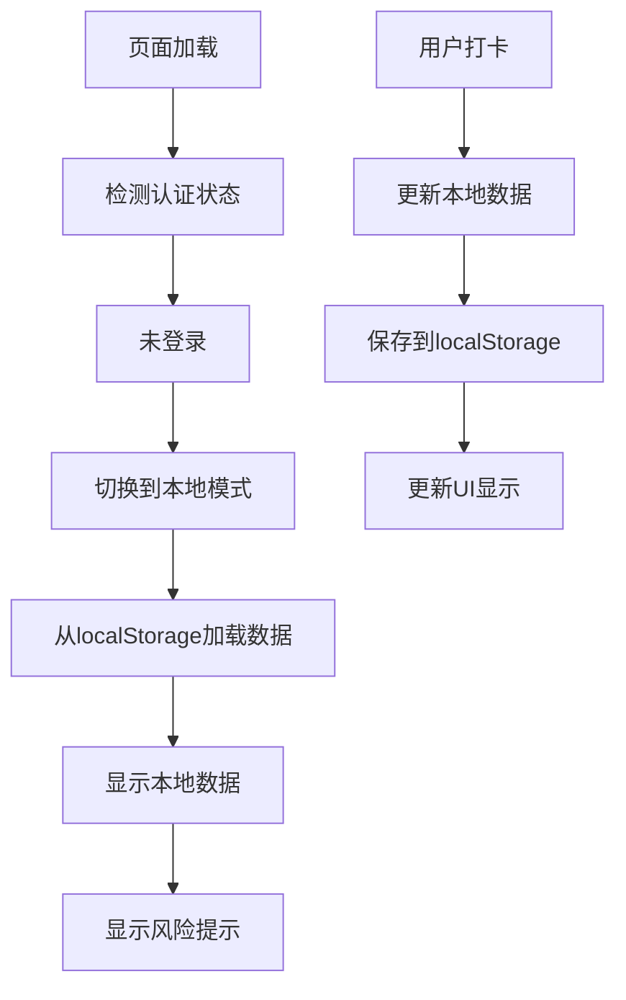
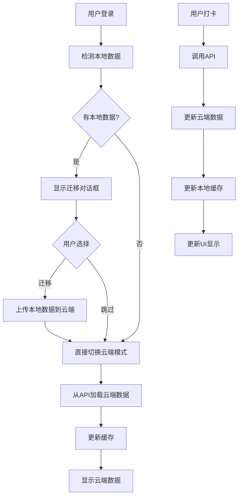
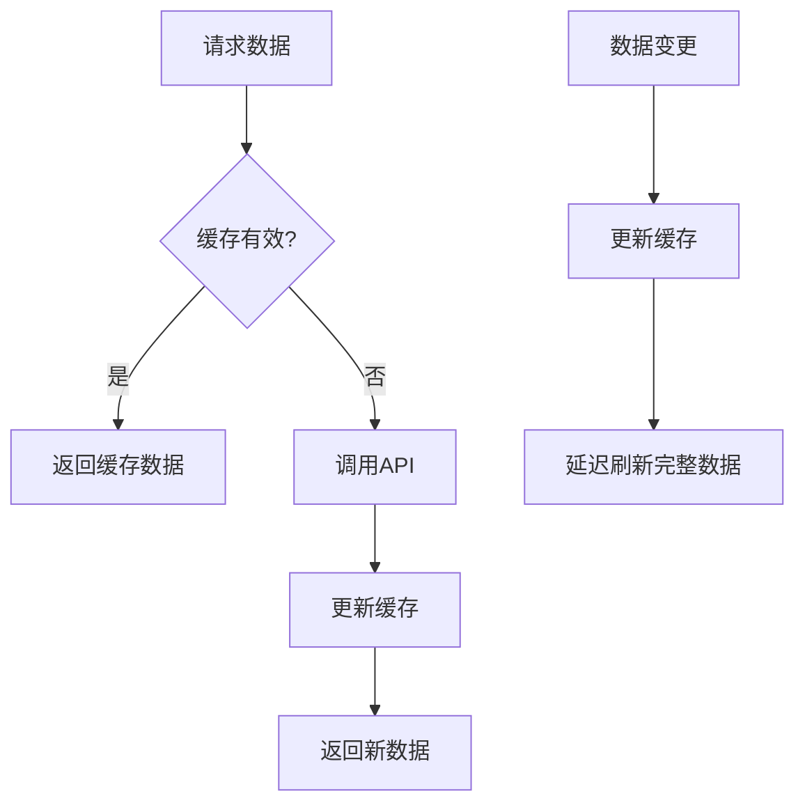

# 🏗️ 分离式数据存储架构

## 📋 概述

实现了完全分离的本地模式和云端模式数据存储，解决了之前复杂的数据同步问题。

## 🎯 设计原则

### 1. **完全分离**
- **本地模式**：未登录用户，数据完全存储在本地（localStorage + IndexedDB）
- **云端模式**：已登录用户，数据完全存储在数据库，不考虑本地数据

### 2. **清晰的数据源指示**
- UI上明确显示当前数据源（本地/云端）
- 状态栏显示数据源和网络状态
- 详细的数据源信息卡片

### 3. **可选的数据迁移**
- 登录时检测本地数据
- 提供迁移选择对话框（5秒自动关闭）
- 两个选项：一次性迁移 / 保持分离

### 4. **云端缓存机制**
- 5分钟缓存有效期
- 内存 + localStorage 双重缓存
- 智能缓存失效和刷新

## 🏛️ 架构组件

### 1. **分离式Store** (`src/store/separated-app-store.ts`)

```typescript
interface SeparatedAppStore {
  // 数据源标识
  dataSource: 'local' | 'cloud'
  
  // 分离的数据
  localData: LocalData
  cloudData: CloudData
  currentData: LocalData | CloudData  // 当前显示的数据
  
  // 缓存机制
  cloudCache: CacheState
  
  // 操作方法
  switchToLocalMode: () => void
  switchToCloudMode: () => Promise<void>
  toggleTaskLocal: (taskId: string) => void
  toggleTaskCloud: (taskId: string) => Promise<void>
  migrateLocalToCloud: () => Promise<MigrationResult>
}
```

### 2. **数据源指示器** (`src/components/ui/data-source-indicator.tsx`)

- **DataSourceIndicator**: 详细信息卡片
- **DataSourceStatusBar**: 顶部状态栏版本
- **NetworkStatusIndicator**: 网络状态指示

### 3. **数据迁移组件** (`src/components/modals/data-migration-modal.tsx`)

- **DataMigrationModal**: 迁移选择对话框
- **LocalDataRiskToast**: 本地数据风险提示

### 4. **云端缓存管理** (`src/utils/cloud-cache.ts`)

```typescript
class CloudCacheManager {
  set<T>(key: string, data: T, ttl?: number): void
  get<T>(key: string): T | null
  invalidate(keyPattern?: string): void
  warmup<T>(key: string, fetcher: () => Promise<T>): Promise<T>
}
```

## 🔄 数据流程

### 1. **用户未登录（本地模式）**



### 2. **用户登录（云端模式）**



### 3. **缓存机制**



## 🎨 UI 组件

### 1. **数据源指示器**

```tsx
// 详细版本
<DataSourceIndicator showDetails={true} />

// 状态栏版本
<DataSourceStatusBar />

// 网络状态
<NetworkStatusIndicator />
```

### 2. **迁移对话框**

```tsx
<DataMigrationModal
  isOpen={showMigrationModal}
  onMigrate={handleMigration}
  onSkip={handleSkipMigration}
  localDataCount={localDataCount}
/>
```

### 3. **风险提示**

```tsx
<LocalDataRiskToast
  isVisible={showRiskToast}
  onClose={hideLocalDataRisk}
/>
```

## 🔧 使用方法

### 1. **基本使用**

```tsx
import { useSeparatedAppStore } from "@/store/separated-app-store"

function MyComponent() {
  const {
    dataSource,
    currentData,
    isAuthenticated,
    toggleTask,
    getCurrentDateTasks
  } = useSeparatedAppStore()
  
  const tasks = getCurrentDateTasks()
  
  return (
    <div>
      <DataSourceIndicator />
      {/* 渲染任务 */}
    </div>
  )
}
```

### 2. **手动切换数据源**

```tsx
const { switchToLocalMode, switchToCloudMode } = useSeparatedAppStore()

// 切换到本地模式
switchToLocalMode()

// 切换到云端模式（需要登录）
await switchToCloudMode()
```

### 3. **缓存管理**

```tsx
const { invalidateCloudCache, loadCloudData } = useSeparatedAppStore()

// 清除缓存
invalidateCloudCache()

// 强制刷新
await loadCloudData(true)
```

## 📊 测试页面

访问 `/separated-test` 查看完整的测试界面，包括：

- 认证状态管理
- 数据源切换
- 本地/云端数据操作
- 缓存状态监控
- 数据迁移测试

## ✅ 优势

1. **简化逻辑**：完全分离，无复杂同步
2. **清晰指示**：用户明确知道数据来源
3. **灵活选择**：支持本地和云端两种模式
4. **性能优化**：云端模式有缓存机制
5. **用户友好**：提供迁移选择和风险提示

## 🔮 未来扩展

1. **离线同步**：网络恢复后自动同步
2. **数据导出**：支持数据导出和导入
3. **多账号支持**：支持切换不同账号
4. **实时同步**：WebSocket实时数据同步

## 🚀 部署说明

1. 确保所有新组件已正确导入
2. 更新主页面使用新的分离式组件
3. 测试本地模式和云端模式的切换
4. 验证数据迁移功能正常工作
5. 检查缓存机制的性能表现
